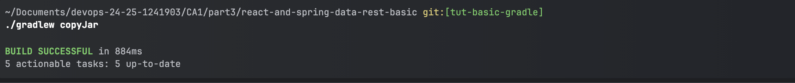

# CA1 Part1 - Technical Report

**Author:** Diana Guedes

**Date:** 24/02/2025

**Discipline:** DevOps

**Program:** SWitCH DEV

**Institution:** Instituto Superior de Engenharia/ Instituto Politécnico do Porto

# Table of Contents

- [Introduction](#introduction)
- [Part 1: Initial Setup](#part-1-initial-setup)
   - [Objectives and Requirements](#objectives-and-requirements)
   - [Cloning the Repository](#cloning-the-repository)
   - [Running the Project Locally](#running-the-project-locally)
   - [Creating the .gitignore File](#creating-the-gitignore-file)
   - [Committing the Initial Version](#committing-the-initial-version)
   - [Versioning with Git Tags](#versioning-with-git-tags)
- [Part 2: Adding a New Feature](#part-2-adding-a-new-feature)
   - [Implementing jobYears Field](#implementing-jobyears-field)
   - [Unit Testing](#unit-testing)
   - [Debugging](#debugging)
   - [Commit History](#commit-history)
   - [Committing and Tagging the Feature](#committing-and-tagging-the-feature)
- [Part 3: Finalizing the Assignment](#part-3-finalizing-the-assignment)
   - [Repository Marking](#repository-marking)
- [Part 4: Branch-Based Development](#part-4-branch-based-development)
   - [Objectives and Requirements](#objectives-and-requirements)
   - [Key Developments](#key-developments)
   - [Working with the Main Branch](#working-with-the-main-branch)
   - [Developing Features in Separate Branches](#developing-features-in-separate-branches)
   - [Integrating and Testing the Email Field](#integrating-and-testing-the-email-field)
   - [Merging the Feature into Main](#merging-the-feature-into-main)
   - [Creating a Bug Fix Branch](#creating-a-bug-fix-branch)
   - [Assignment Completion](#assignment-completion)
- [Final Outcomes](#final-outcomes)
   - [Implementation](#implementation)
   - [Tagging Significant Milestones](#tagging-significant-milestones)
   - [Issue Tracking and Management](#issue-tracking-and-management)
- [Alternative Solution](#alternative-solution)
   - [Exploring an Alternative to Git](#exploring-an-alternative-to-git)
   - [Comparison of SVN and Git](#comparison-of-svn-and-git)
   - [Applying SVN to This Assignment](#applying-svn-to-this-assignment)
- [Conclusion](#conclusion)


## Introduction
This document addresses the Version Control with Git assignment for the DevOps discipline. The work is organized into two main parts: first, a straightforward use of version control without branching, and second, an extension that introduces new features and fixes bugs through branching. In the Final Results section, you’ll find a visual representation of how the application has evolved after merging all enhancements and corrections. Additionally, an Alternative Solution is explored—Subversion (SVN)—to discuss its characteristics and evaluate its suitability for the objectives of this assignment.

## Part 1: Initial Setup

**Objectives and Requirements**
The first segment of this assignment concentrates on grasping essential version control processes without the use of branches. You’ll begin by preparing the project environment, making modifications directly on the master branch, and committing those updates. A primary requirement is to implement a new feature (for instance, a jobYears property in an Employee object) and then correctly handle version tags—starting with an initial version and updating it once the feature is added. The focus here is on practicing commits, understanding the commit history, and applying tags for effective versioning.

**Creating My Repository:** I created a new folder on my local machine for the DevOps class assignments and initialized it as a Git repository. This was the first step in establishing my workspace for the project.
```sh
mkdir ~/devops-24-25-1241903
cd ~/devops-24-25-1241903
mkdir CA1
cd CA1
mkdir part1
cd part1
git init
```

### Cloning the Repository
The first step, after creating the folders and the github repository, was to clone the **Tutorial React.js and Spring Data REST** application from the official repository:

```sh
git clone https://github.com/spring-attic/tut-react-and-spring-data-rest
```

Steps:
1. Navigate to the desired directory:
   ```sh
   cd ~/Documents/devops-24-25-1241903/CA1/part1/
   ```
2. Clone the repository:
   ```sh
   git clone https://github.com/spring-attic/tut-react-and-spring-data-rest 
   ```
3. Navigate to the cloned directory:
   ```sh
   cd CA1/part1
   ```
4. Verify the setup:
   ```sh
   ls -la
   ```

### Running the Project Locally
After cloning, the next step was to verify if the project ran locally:

```sh
./mvnw spring-boot:run
```

Once confirmed that the application was running on localhost, the next step was to move the `basic` folder into **IntelliJ IDEA** to start implementing the required modifications. The other folders were deleted for this assigment.

### Creating the .gitignore File

To avoid committing unnecessary files, a .gitignore file was created and customized to exclude unwanted files from version control. The file was generated using gitignore.io and manually supplemented.

Steps:

Created the file using the terminal:

```sh
touch .gitignore
```

Generated an initial configuration using Gitignore.io

Manually added additional entries to ignore logs, IDE-specific files, and system-generated artifacts:

### Java ###
*.class
*.log
.mtj.tmp/
target/
.mvn/
.gradle/
bin/

### Node ###
node_modules/
logs/
*.log
coverage/
.next/

### IDEs ###
.idea/
.vscode/
*.iml
*.swp

### macOS ###
.DS_Store
.AppleDouble
.Trashes

The .gitignore ensured that only relevant files were tracked by Git, improving repository cleanliness and maintainability.

### Committing the Initial Version
Once the repository was cloned, it was necessary to commit and push the changes to ensure tracking from the beginning.

Steps:
```sh
   git add .
   git commit -m "Created CA1 and part1 folder and added tutorial React.js + spring data rest code in CA1/par1 and checked if this run and open in localhost"
   git push origin main
```

### Versioning with Git Tags
To properly manage versions, a tagging system was implemented to mark different phases of development. The initial version was tagged as `v1.1.0`.

Steps:
```sh
   git tag v1.1.0
```

## Part 2: Adding a New Feature
### Implementing `jobYears` Field
In this initial phase, the main objective involved introducing a new feature by adding a jobYears field to track how long an employee has worked at the company. Alongside this, I implemented unit tests to confirm that Employees are correctly created and their attributes are properly validated. Special attention was given to ensuring that jobYears only accepts integer values, and that String fields cannot be null or empty.

**Files Updated:**
   - Employee.java: This class, which represents the employee model, was modified to include a new integer field called jobYears. Getter and setter methods were introduced for this field, and parameter validation was integrated to maintain data integrity. Below is an outline of the key updates made to support the new functionality and enforce thorough data checks.

1. Adding a **Integer** type attribute `jobYears`.
2. Including it in the constructor.
3. Implementing necessary validations.
4. Updating the **JavaScript frontend** to display the new field.

Example code:
```java
@Entity 
public class Employee {

    private @Id
    @GeneratedValue Long id; // <2>
    private String firstName;
    private String lastName;
    private String description;
    private Integer jobYears;

    public  Employee() {
    }

    public Employee(String firstName, String lastName, String description, Integer jobYears) {
        if(!isParametersInvalid(firstName)){
            this.firstName = firstName;}
        if(!isParametersInvalid(lastName)){
            this.lastName = lastName;}
        if(!isParametersInvalid(description)){
            this.description = description; }
        if(!isjobYearsInvalid(jobYears)){
            this.jobYears = jobYears; }

    }
}
```

### Unit Testing
**EmployeeTest.java:** To confirm that the newly introduced jobYears field works correctly, this class incorporates a set of unit tests covering multiple scenarios:

- Validation Tests: Verified that both the constructor and the setters reject invalid inputs (e.g., null or empty strings, negative jobYears), ensuring objects are never created with faulty data.
- Positive Scenarios: Confirmed that valid inputs result in successful object creation without exceptions, demonstrating that the Employee class behaves correctly under proper usage.
- Equality and Hashing: Tested the equals and hashCode implementations to guarantee consistent comparisons between Employee objects.
- String Representation: Checked the toString method to make sure it accurately reflects the state of the Employee object, aiding in debugging and logging.
- Ran tests using Maven:

```sh
   ./mvnw test
```

Example test:
```java
 @Test
public void testSetJobYears_ValidValue() {
    Employee emp = new Employee("John", "Doe", "Developer", 5);
    emp.setJobYears(10);
    assertEquals(10, emp.getJobYears()); 
}
```

**app.js:**
To accommodate the newly added jobYears attribute, the React components in app.js were revised to show the field within the employee list. Both EmployeeList and Employee now include a “Job Years” column in the displayed table, enabling users to easily see how long each employee has worked for the company alongside their other information. Below is a code sample that demonstrates how jobYears was incorporated into the application’s frontend.
```java
// tag::employee-list[]
class EmployeeList extends React.Component{
   render() {
		const employees = this.props.employees.map(employee =>
			<Employee key={employee._links.self.href} employee={employee}/>
		);
      return (
              <table>
				<tbody>
				<tr>
					<th>First Name</th>
					<th>Last Name</th>
					<th>Description</th>
					<th>Job Years</th>
				</tr>
              {employees}
              </tbody>
			</table>
		)
   }
}
```
```java
class Employee extends React.Component{
   render() {
      return (
              <tr>
				<td>{this.props.employee.firstName}</td>
				<td>{this.props.employee.lastName}</td>
				<td>{this.props.employee.description}</td>
				<td>{this.props.employee.jobYears}</td>
			</tr>
		)
   }
}
```


### Debugging
Once the integration of the jobYears field was confirmed, I launched the application with ./mvnw spring-boot:run and tested its live functionality at http://localhost:8080/. This hands-on review was vital to ensure seamless performance alongside existing features. In parallel, I performed a detailed code review to verify data handling on the server side and the accurate display of jobYears on the client side, maintaining both feature correctness and high code quality.
Debugging was performed in two phases:
1. **Server-side debugging**: Used breakpoints in IntelliJ to analyze the request processing in Spring Boot.
2. **Client-side debugging**: Used **React Developer Tools** to inspect UI changes and validate the integration of `jobYears` in the frontend.

## Commit History
The development process was carefully tracked through commits, ensuring step-by-step documentation of changes. Some key commits include:

- **Initial Setup**: Created CA1 and part1 folder, added tutorial React.js + Spring Data REST code, and verified it ran on localhost.
- **Git Management**: Added and updated `.gitignore` multiple times to ensure proper tracking of necessary files.
- **Feature Implementation**: Updated `Employee` class with the `jobYears` attribute, new methods, and corresponding tests.
- **Frontend Integration**: Modified the JavaScript files to display `jobYears` for the client.
- **Validation and Debugging**: Implemented additional validation methods for `jobYears` and debugged both backend and frontend using appropriate tools.

### Committing and Tagging the Feature
Once the feature was successfully implemented and tested, it was committed and tagged as version `v1.2.0`.

Steps:
```sh
   git add .
   git commit -m "Added ReadMe file and finish the first week"
   git push origin main
   git tag v1.2.0
   git push origin v1.2.0
```

## Part 3: Finalizing the Assignment
### Repository Marking
To complete the first week assignment, the repository was marked with the required tag.

Steps:
```sh
   git tag ca1-part1.1
   git push origin ca1-part1.1
```


## Conclusion
This assignment successfully demonstrated core DevOps practices, including:
- **Version control with Git**, ensuring traceability of changes.
- **Automated testing with Maven**, verifying application correctness.
- **Application debugging**, identifying and resolving issues at both server and client levels.
- **Frontend integration**, ensuring `jobYears` was displayed correctly on the UI.


### Part 4: Branch-Based Development

### Objectives and Requirements

This section focuses on utilizing branches for feature development and bug fixes, highlighting the importance of isolated workspaces and efficient merging techniques.

Key requirements include creating dedicated branches for new functionalities or corrections, ensuring that modifications remain separate from the main codebase until they are ready for integration.

The section concludes with tagging the main branch following successful merges to indicate new application versions, demonstrating effective branch organization and version control practices.

### Key Developments

In this phase, development was structured around branching strategies to introduce new features and address existing issues while maintaining the stability of the main branch. This ensured that stable releases of the **Tutorial React.js and Spring Data REST Application** remained unaffected by ongoing changes.

Since the approach for implementing new features and resolving bugs aligns with the methodology used in Part 1, repetitive code demonstrations have been omitted. The primary distinction in this section is the incorporation of branching. Below are the core steps:

#### Working with the Main Branch

To confirm the correct working branch, particularly when preparing stable releases, I used the `git branch` command. This was a critical step in validating the current branch, which is marked with an asterisk (*) in the command output.

#### Developing Features in Separate Branches

During the implementation of an **email field**, effective branch management played a crucial role. The development began by creating a dedicated feature branch and switching to it for all related updates. The process followed these steps:

1. A new branch named `email-field` was created to house all developments concerning the email feature.
2. The active workspace was switched to this branch to commence development.
3. The `git branch` command was executed again to confirm the switch was successful.

Commands used:
```sh
# Create and switch to the feature branch
git branch email-field
git checkout email-field
git branch
```

#### Integrating and Testing the Email Field

The process of adding and validating the email field mirrored the approach used in **Part 1** for the `jobYears` field. The key steps included:

- **Code Implementation:** Expanding the `Employee` class to include the new `email` field along with appropriate getter and setter methods. The update extended to models, forms, and views, ensuring full integration across both frontend and backend.
- **Unit Testing:** Writing comprehensive test cases to confirm correct creation of `Employee` instances with the email field, enforcing validation rules such as non-null and properly formatted values.
- **Debugging:** Conducting thorough debugging on both the server and client sides to identify and fix any issues introduced by the new feature.

#### Merging the Feature into Main

Once development of the email field was complete, a structured process was followed to merge the changes into the main branch and update the application's version:

1. Committing finalized modifications.
2. Pushing the feature branch to the remote repository.
3. Switching to the main branch and performing a **no-fast-forward** merge.
4. Updating the remote main branch.
5. Tagging the new version to mark this release.

Commands executed:
```sh
# Commit the new feature
git add .
git commit -m "Added new field called email in Employee + tests in EmployeeTest and DatabaseLoader.java"
git push -u origin email-field

# Switch to main branch and merge
git checkout main
git merge --no-ff email-field

# Push the merged changes to update the main branch
git push

# Tag the new version and push it
git tag -a v1.3.0 
git push origin v1.3.0
```

#### Creating a Bug Fix Branch

To resolve an issue with email validation in the `Employee` class, a separate branch named `fix-invalid-email` was created following the standard workflow. The process adhered to the structured development, testing, and merging practices used previously, ensuring stability and code integrity.

The primary fix involved enhancing the `Employee` class with validation logic to enforce the presence of an `@` symbol in email addresses:
```java
public boolean isEmailInvalid(String email){
   return  email == null || email.isBlank() || !email.contains("@") ;
}
```

### Assignment Completion

After implementing and validating the fix, the changes were merged into the main branch. The application version was then updated to `v1.3.1` to reflect this minor improvement. To mark the end of the assignment, the repository was tagged as `ca1-part2` to indicate the completion of this phase.

### Final Outcomes

### Implementation

After integrating all the newly developed features, the final version of the application is summarized below:


The employee model within the application initially consisted of the fields First Name, Last Name, and Description, which were already part of the structure before this project and remained unchanged. Development improvements began with the introduction of the Job Title field in an earlier task. Later, during Part 1 of CA1, the Job Years field was implemented to track how long employees have been with the company. The most recent update, introduced in Part 2 of CA1, was the addition of the Email field, which further enriched the model by incorporating employee contact details.

### Branch Management 

The following image displays the current branches in the repository, obtained by running the git branch command:


Through this assignment, I gained insight into the significance of branch-based development for managing feature updates and bug fixes. Keeping changes isolated in dedicated branches helps maintain a stable main branch while ensuring an organized and traceable modification history.

### Tagging Significant Milestones

The next image visually represents the project's tags, retrieved using the git tag command:


By using tags, I learned how to mark specific versions of the application as key milestones. This approach is essential for tracking progress, making it easier to revert to previous versions when needed, and maintaining a structured version history.

### Issue Tracking and Management

Throughout development, issues were created in GitHub to document and track problems that emerged. These issues were resolved and automatically closed by including  for example "Fix #1"  in the commit messages. Below is an illustration of some of the issues created and successfully closed during this process:


Issues are a valuable tool for project management, serving multiple purposes, including bug tracking, feature requests, and task management. They can be assigned to team members, categorized using labels, and linked to specific commits or pull requests. Moving forward, the objective is to leverage issues throughout the entire development cycle, improving task organization, progress tracking, and collaboration, particularly in team-based environments.

### Alternative Solution

### Exploring an Alternative to Git

For version control beyond Git, **Subversion (SVN)** offers a centralized approach, differing from Git's decentralized system. This section contrasts the features of **SVN vs. Git** and explains how SVN can be applied to accomplish the objectives of this assignment.

### **Comparison of SVN and Git**

| Feature | SVN | Git |
|---------|----|-----|
| **Architecture** | Centralized, relying on a single repository as the source of truth. | Distributed, allowing multiple full copies of the repository for redundancy and collaboration. |
| **Versioning Model** | Assigns incremental version numbers per file. | Uses a snapshot-based model, tracking the entire repository at each commit. |
| **Branching & Merging** | Supports branching and merging but requires more manual intervention. | Provides seamless branching and merging, optimized for parallel development. |
| **Handling Binary Files** | Efficiently manages binary files using delta storage to minimize space. | Stores full copies of binary files with each change, potentially increasing repository size. |

### **Applying SVN to This Assignment**

The following outlines how SVN could be utilized in a workflow similar to Git’s:

#### **1. Initial Repository Setup**
Establishing a centralized repository to store the **Tutorial React.js and Spring Data REST Application**:

```sh
# Create a new SVN repository
svnadmin create /path/to/svn_repository

# Import the application into SVN
cd /path/to/TutorialReactSpringDataREST
svn import . file:///path/to/svn_repository/my_project -m "First commit"
```

#### **2. Developing Features Using Branches**
To manage new features, branches can be created in SVN:

```sh
# Create a branch for the new feature
svn copy file:///path/to/svn_repository/my_project/trunk \
         file:///path/to/svn_repository/my_project/branches/feature-branch \
         -m "Creating branch"
```

#### **3. Committing Changes & Tagging Releases**
Changes are committed to maintain a clear development history, while stable versions are tagged:

```sh
# Commit changes within the feature branch
cd /path/to/working_copy/feature-branch
svn commit -m "Implemented new feature"

# Tag a stable release
svn copy file:///path/to/svn_repository/my_project/trunk \
         file:///path/to/svn_repository/my_project/tags/v1.0 \
         -m "Tagging version v1.0"
```

#### **4. Merging Features into the Main Branch**
After thorough testing, features can be merged back into the trunk:

```sh
# Merge the feature branch into the trunk
svn merge --reintegrate file:///path/to/svn_repository/my_project/branches/feature-branch /path/to/working_copy/trunk
svn commit -m "Merged branch"
```

By leveraging SVN’s features, a structured workflow similar to Git can be established, demonstrating the adaptability of version control systems in software development.

---

### **Conclusion**

Completing the **Version Control with Git** assignment has deepened my understanding of version control methodologies and their significance in software development. **Part 1** introduced fundamental concepts, emphasizing direct modifications to the main branch and best practices for committing and tagging.

The transition to **Part 2**, where branching was introduced, provided insight into managing feature development and bug fixes efficiently, reinforcing the importance of isolating changes for better version tracking. The final results illustrate the practical impact of these principles, showcasing improvements in the application’s functionality.

Additionally, **GitHub Issues** were utilized to document and resolve problems systematically, offering a structured problem-solving approach that highlights the usefulness of issue tracking in development projects.

The comparison of **SVN as an alternative to Git** offered a broader perspective on version control strategies. By examining SVN’s centralized nature against Git’s distributed model, I gained a better understanding of how different systems can be adapted to meet diverse project needs, highlighting the flexibility required in DevOps practices.

This assignment has not only strengthened my **technical proficiency with Git** but also emphasized the crucial role of version control in fostering collaboration, maintaining code integrity, and efficiently managing project evolution.


## CA1 Part 2: Build Tools with Gradle – Technical Report

## **Table of Contents**

- [Introduction](#introduction)
- [Environment Setup](#environment-setup)
- [Gradle Basic Demo](#gradle-basic-demo)
- [Creating a New Task](#creating-a-new-task)
- [Adding a Unit Test](#adding-a-unit-test)
- [Defining a Copy Task](#defining-a-copy-task)
- [Implementing a Zip Task](#implementing-a-zip-task)
- [Conclusion](#conclusion)

---

## **Introduction**

This report presents the work completed for the **Build Tools with Gradle** assignment as part of the **DevOps** course. The main objective was to explore Gradle’s practical functionalities, beginning with basic configurations and extending to creating custom tasks, unit testing, and automating file handling operations.

Following the **Environment Setup**, the report walks through the **Gradle Basic Demo**, where a multi-threaded chat server was built and executed. From there, additional Gradle tasks were integrated, including a task for server automation, unit testing implementation, and file operations such as copying and zipping project files. The **Conclusion** section reflects on key learning takeaways and practical applications of Gradle for software development workflows.

---

## **Environment Setup**

The first step involved setting up a structured working directory (`/CA1/part2`) and cloning the required project repository from Bitbucket. The provided repository already contained a `build.gradle` file along with the Gradle Wrapper, ensuring consistency in the development environment.

To confirm a successful Gradle installation, I ran:
```sh
gradle -v
```
Once the project was integrated into an IDE supporting Gradle, I verified the setup by running a basic Gradle build process. This preliminary step was crucial in ensuring that the project dependencies were correctly configured and that the build environment was stable before proceeding with further development.

---

## **Gradle Basic Demo**

The **Gradle Basic Demo** served as an introduction to Gradle’s build and execution capabilities by running a **multi-threaded chat server** supporting multiple simultaneous connections.

### **Build Process**
The following command was used to compile and package the project:
```sh
./gradlew build
```

This generated an executable `.jar` file, confirming that the build process was successfully completed.

### **Starting the Server**
To launch the chat server, the following command was executed:
```sh
java -cp build/libs/basic_demo-0.1.0.jar basic_demo.ChatServerApp 59001
```

The output confirmed that the server was running and actively waiting for incoming client connections.

### **Client Connections**
For testing, multiple client instances were connected using:
```sh
./gradlew runClient
```
Each client was configured to connect to `localhost` on port **59001**, demonstrating the system’s ability to handle concurrent connections.


---

## **Creating a New Task**

A new Gradle task named **runServer** was added to automate the process of starting the chat server, eliminating the need for manual command-line input.

**Updated `build.gradle` file:**
```gradle
task runServer(type: JavaExec, dependsOn: classes) {
    group = "Chat Application of DevOps"
    description = "Starts a multi-user chat server that listens on port 59001"

    classpath = sourceSets.main.runtimeClasspath

    mainClass = 'basic_demo.ChatServerApp'

    args '59001'
}
```

To verify the implementation, I executed:
```sh
./gradlew runServer
```
The successful execution confirmed that the task had been correctly integrated into the Gradle build process.


---

## **Adding a Unit Test**

To improve code reliability, a unit test was introduced for the **App class** to verify its behavior. The test was written in `AppTest.java` under `src/test/java/basic_demo/`.

**JUnit Dependency (added to `build.gradle`)**:
```gradle
    testImplementation 'org.junit.jupiter:junit-jupiter:5.9.1'
```

**AppTest.java**:
```java
package basic_demo;

import org.junit.Test;
import static org.junit.Assert.*;

public class AppTest {
    @Test
    public void testAppHasAGreeting() {
        App classUnderTest = new App();
        assertNotNull("app should have a greeting", classUnderTest.getGreeting()); }
}
```
To run the test, the following command was executed:
```sh
./gradlew test
```
The test successfully passed, confirming the correctness of the implementation.


---

## **Defining a Copy Task**

A **backup task** was created to **copy** the source files to a designated backup folder, ensuring a safeguard mechanism in case of issues.

**Backup Task Definition (`build.gradle`)**:
```gradle
task backup(type: Copy) {
    group = "Utilities"
    description = "Creates a backup of the src folder into a new backup folder"

    from 'src'
    into 'backup'
}
```
To execute the task, I ran:
```sh
./gradlew backup
```
This operation successfully copied the contents of `src/` to a **backup/** folder in the project directory.


---

## **Implementing a Zip Task**

A **zip task** was created to compress the source code into a `.zip` file for distribution and backup purposes.

**Task Definition (`build.gradle`)**:
```gradle
task zip(type: Zip) {
    group = "DevOps"
    description = "Creates a zip archive of the source code"

    from 'src'
    destinationDirectory = file('build')
    archiveFileName = 'src_backup.zip'
}
```

To create the zip, the following command was executed:
```sh
./gradlew zip
```


This process successfully generated a `src_backup.zip` file in the **build/** directory.


---

## **Conclusion**

This assignment provided valuable hands-on experience with Gradle, reinforcing its role as a **powerful build tool**. The tasks performed throughout the project demonstrated Gradle’s capabilities in:

- **Automating build processes** for better efficiency.
- **Creating custom tasks** to streamline development workflows.
- **Integrating unit testing** to improve code reliability.
- **Managing files efficiently** using `Copy` and `Zip` tasks.

By implementing **custom Gradle tasks**, such as `runServer`, `backup`, and `zip`, the project gained increased automation, flexibility, and maintainability. The ability to define and execute Gradle tasks tailored to project-specific requirements highlights its adaptability in real-world software development.

This experience has strengthened my understanding of build automation, dependency management, and task execution in Gradle, making it a valuable skill for future DevOps and software engineering projects.

---

# CA1 Part3: Build Tools with Gradle

---
## Introduction Part 3

This report outlines the work completed in the second phase of Class Assignment 3 for the DevOps course, focusing on the implementation of Gradle as a build automation tool. The assignment consists of a structured set of tasks aimed at migrating a Spring Boot application from Maven to Gradle, demonstrating the practical benefits of this transition in modern software development workflows.

The Set Up Initial Gradle Project section provides an overview of the initial configuration process. Integrate Existing Code details the migration of the application's source files into the Gradle project structure. Configure Frontend Plugin for Gradle explains how a plugin was incorporated to manage frontend dependencies efficiently. In Add Gradle Tasks for File Management, custom tasks were created to enhance project organization and maintenance. An Alternative Solution explores different build tools that could be used for similar projects. Finally, the Conclusion reflects on key takeaways, emphasizing the role of Gradle in optimizing development processes.

## Set Up Initial Gradle Project

The setup of the Gradle project followed a structured approach to facilitate a smooth transition from a **Maven-based** structure to **Gradle**. This process involved multiple key steps to ensure a well-organized and manageable migration.

### **Creating a Dedicated Branch**
To isolate changes and maintain a clear development workflow, a new branch was created for this part of the assignment using the following command:
```sh
git checkout -b tut-basic-gradle
```

### **Initializing the Spring Boot Project**
A new **Spring Boot** project was generated using the [Spring Initializr](https://start.spring.io/) web tool. The project configuration included essential dependencies such as:
- **REST Repositories**
- **Thymeleaf**
- **JPA**
- **H2 Database**

These dependencies ensure the application's required functionalities are available and properly managed by Gradle.

### **Project File Setup**
After downloading the `.zip` file generated by Spring Initializr, the contents were extracted into the repository directory: `CA1/Part3/`. This provided a structured foundation for an **empty** Spring Boot application, which was now ready for Gradle-based builds.

### **Verifying the Gradle Setup**
To confirm that the project was correctly configured and to view available Gradle tasks, the following command was executed in the root directory:
```sh
./gradlew tasks
```

### **Gradle Task List Output**


The successful execution of these steps confirmed that the **Gradle build system** was correctly configured and functional. The comprehensive list of tasks highlighted the automation and flexibility available through **Gradle**, laying a strong foundation for further customization and development in the next phases of the project.

# Integrate Existing Code

At this stage of the project, the existing codebase from a tutorial setup was integrated into the newly established **Gradle** framework. The process was carefully executed to ensure full compatibility with the new build system and maintain seamless functionality.

### **Steps for Code Integration**

#### **1. Replacing the Source Directory**
The default `src/` directory in the Gradle project was removed to accommodate the tutorial’s existing source code. The `src/` folder, along with its subdirectories, was copied from the tutorial project into the new Gradle structure.

#### **2. Adding Essential Configuration Files**
To retain frontend build configurations and dependencies, key configuration files such as:
- `webpack.config.js`
- `package.json`

were copied into the root directory of the Gradle project.

#### **3. Cleaning Up Redundant Directories**
Since Webpack automatically generates the `src/main/resources/static/built/` directory during the build process, this folder was deleted to prevent unnecessary version control tracking and potential conflicts.

### **Resolving Migration Issues**

During the transition from **CA1** to **CA1.part3**, a few compilation errors were encountered. The following adjustments were made to resolve them:

#### **1. Updating Import Statements**
Due to the shift from **Java EE** to **Jakarta EE**, the import statements in `Employee.java` were modified:
- **Before:** `javax.persistence.*`
- **After:** `jakarta.persistence.*`

#### **2. Configuring the Package Manager**
To maintain consistency across environments, `package.json` was updated with a fixed package manager version:
```json
"packageManager": "npm@9.6.7"
```
This ensures that all developers use the same **Node.js package manager** version, preventing dependency conflicts.

### **Testing the Integrated Code**

#### **1. Running the Backend**
To verify that the backend was functioning correctly, the following command was executed:
```sh
./gradlew bootRun
```


This command compiled and launched the application.

#### **2. Checking the Frontend**
Opening `http://localhost:8080` in a web browser displayed an **empty page**. This was expected at this stage since the necessary **Gradle frontend plugin** had not yet been added. This issue would be addressed in the next phase of the project setup.

By following these integration steps, the tutorial code was successfully adapted to the Gradle project structure. This process laid the groundwork for further **enhancements and additional functionalities**, ensuring a stable and well-structured development environment.

# Configure Frontend Plugin for Gradle

To ensure proper handling of frontend assets within the newly migrated **Gradle** environment, the `org.siouan.frontend-gradle-plugin` was introduced. This plugin plays a crucial role in managing frontend dependencies and build processes, providing functionality similar to the **frontend-maven-plugin** used in **Maven**-based projects.

### **Adding the Plugin**
To integrate the **frontend plugin**, the `build.gradle` file was updated with the appropriate plugin configuration for **Java 17**:
```gradle
id "org.siouan.frontend-jdk17" version "8.0.0"
```

### **Configuring the Plugin**
The plugin settings were adjusted to define the **Node.js version** and the **frontend build commands**, ensuring seamless execution of essential tasks:
```gradle
frontend {
	nodeVersion = "16.20.2"
	assembleScript = "run build"
	cleanScript = "run clean"
	checkScript = "run check"
}
```

### **Updating Frontend Build Scripts**
To align the **Webpack** execution process with Gradle, the `package.json` file was updated with the necessary build scripts:
```json
"scripts": {
"webpack": "webpack",
"build": "npm run webpack",
"check": "echo Checking frontend",
"clean": "echo Cleaning frontend",
"lint": "echo Linting frontend",
"test": "echo Testing frontend"
},
```

### **Verifying the Configuration**
After applying these changes, a series of tests were performed to confirm that the **frontend plugin** was correctly integrated and functioning as expected.

#### **1. Building the Project**
Executing the following command validated that Gradle successfully incorporated frontend assets into the build process:
```sh
./gradlew build
```


#### **2. Running the Application**
To verify that the frontend was now properly rendered, the application was launched using:
```sh
./gradlew bootRun
```


Accessing `http://localhost:8080` in a web browser confirmed that the frontend content was correctly loaded, indicating that Gradle was successfully managing frontend resources.


# Add Gradle Tasks for File Management

To optimize the handling of project files, particularly in **distribution and cleanup processes**, two custom Gradle tasks were implemented: `copyJar` and `cleanWebpack`. These tasks streamline the build pipeline by automating essential file operations.

### **1. Implementing the `copyJar` Task**

#### **Purpose**
The `copyJar` task ensures that the `.jar` file produced by the `bootJar` task is copied directly from the build output directory into a dedicated `dist/` folder at the project root. This guarantees that only the latest fully assembled build is used for distribution, preventing outdated files from being included in deployments.

#### **Configuration**
```gradle
task copyJar(type: Copy) {
	dependsOn bootJar
	from bootJar.outputs
	into file("dist")
}
```

#### **Dependency Management**
Since `copyJar` depends on `bootJar`, it will only execute after the `.jar` file has been successfully built, ensuring proper version control and preventing partial builds from being deployed.

### **2. Implementing the `cleanWebpack` Task**

#### **Purpose**
The `cleanWebpack` task removes all files generated by **Webpack** that are stored in `src/main/resources/static/built`. This helps maintain a clean build environment by ensuring that only relevant and up-to-date files are included in each deployment.

#### **Configuration**
```gradle
task cleanFrontEnd(type: Delete) {
	delete 'src/main/resources/static/built'
}
clean.dependsOn cleanFrontEnd
```

#### **Automatic Execution**
The `cleanWebpack` task is configured to run as part of Gradle's standard `clean` task, ensuring that stale files are removed before a new build is created.

### **Task Execution & Verification**

#### **Running `copyJar`**
**Command:**
```sh
./gradlew copyJar
```


**Expected Outcome:**
- The `.jar` file generated by `bootJar` is successfully copied to the `dist/` folder.
- The correct file is used for deployment, preventing outdated versions from being mistakenly distributed.

#### **Running `cleanFrontEnd`**
**Command:**
```sh
./gradlew cleanFrontEnd
```


**Expected Outcome:**
- The contents of `src/main/resources/static/built` are completely removed.
- Prevents conflicts by ensuring only the necessary frontend files are included in each build.

### **Conclusion**
By integrating `copyJar` and `cleanWebpack` into the **Gradle build process**, file management is automated, enhancing both **efficiency** and **reliability**. These tasks contribute to a more streamlined and consistent deployment process, reducing the risk of outdated or unnecessary files affecting application performance.


