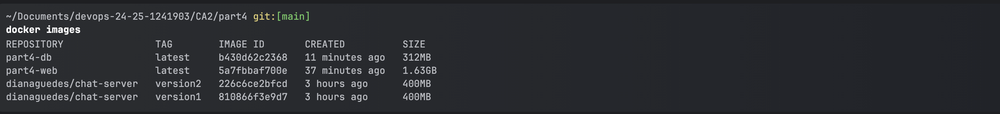

## CA2 - Part 1: Virtualization with Vagrant - Technical Report
**Author:** Diana Guedes  
**Date:** 04/2025  
**Discipline:** DevOps  
**Program:** SWitCH DEV  
**Institution:** Instituto Superior de Engenharia do Porto (ISEP)


### Table of Contents

1. [Introduction](#1-introduction)
2. [Virtual Machine Setup](#2-virtual-machine-setup)
3. [Network Configuration and Services](#3-network-configuration-and-services)
4. [Cloning the Repository](#4-cloning-the-repository)
5. [Set Up Development Environment](#5-set-up-development-environment)
6. [Running the Spring Boot Tutorial Project](#6-running-the-spring-boot-tutorial-project)
7. [Running the gradle basic demo Project](#7-running-the-gradle-basic-demo-project-)
8. [Running the gradle_basic_demo Project – Part 2](#8-running-the-gradle_basic_demo-project--part-2)
9. [Conclusion](#9-conclusion)
10. [Environment Setup](#environment-setup)
11. [macOS (M2) Configuration](#macos-m2-configuration)
12. [Base Project Setup](#base-project-setup)
13. [Customizing the Vagrantfile](#customizing-the-vagrantfile)
14. [Connecting Spring Boot to the H2 Database](#connecting-spring-boot-to-the-h2-database)
15. [Running the Project](#running-the-project)
16. [Vagrant Commands](#vagrant-commands)
17. [Alternative Solution: UTM/QEMU vs VMware](#alternative-solution-utmqemu-vs-vmware)
18. [Conclusion](#conclusion-part2)
19. [CA2 - Part 3: Containers with Docker: Technical Report](#ca2---part-3-containers-with-docker-technical-report)
20. [Introduction](#introduction)
21. [Environment Setup](#environment-setup)
22. [Version 1: Building the Chat Server Inside Docker](#version-1-building-the-chat-server-inside-docker)
23. [Version 2: Building the Chat Server Outside Docker](#version-2-building-the-chat-server-outside-docker)
24. [Conclusion](#conclusion-part3)

---


### 1. Introduction

This report outlines the steps I followed to complete Part 1 of the CA2 assignment, focused on exploring virtualization through VirtualBox and UTM on an Ubuntu Server environment. The goal of this assignment was to gain hands-on experience with virtual machines and simulate real-world software development environments.

Throughout this report, I describe how I created and configured a VM, installed the necessary development tools, cloned and executed previous Java-based projects inside the virtual environment, and ensured communication between the VM and my host machine.

---

### 2. Virtual Machine Setup

To begin, I installed UTM from its official website and proceeded to create a new virtual machine using the graphical interface. I assigned a meaningful name, selected Linux as the OS type, and chose the appropriate Ubuntu version.

I allocated RAM and created a virtual hard disk with enough storage for development tools and projects. 

After installing , I configured the VM settings to match the requirements of the assignment. This included assigning **two network adapters**:
- Adapter 1 set to **NAT**, to allow internet access from within the VM.
- Adapter 2 configured as a **Host-Only Adapter** , to allow communication between the VM and the host machine.

---

### 3. Network Configuration and Services

With the VM ready, I moved on to setting up the network and essential services.

 I created a new host-only interface and defined the static IP address `192.168.56.5` for the second adapter (enp0s8), ensuring it fell within the host-only subnet.

After booting the VM, I updated the package index:

```bash
sudo apt update
```

I then installed useful networking tools:

```bash
sudo apt install net-tools
```

To assign the static IP, I edited the network config file:

```bash
sudo nano /etc/netplan/01-netcfg.yaml
```

To apply the changes:

```bash
sudo netplan apply
```

For remote access and secure file transfer, I installed and configured both **SSH** and **FTP**:

```bash
sudo apt install openssh-server
sudo nano /etc/ssh/sshd_config
# Enabled PasswordAuthentication
sudo service ssh restart
```

For FTP access:
```bash
sudo apt install vsftpd
sudo nano /etc/vsftpd.conf
# Enabled write_enable=YES
sudo service vsftpd restart
```

---

### 4. Cloning the Repository

To access my personal codebase within the virtual machine, I established a secure SSH connection between the VM and GitHub. This ensured that I could interact with my remote repository without needing to enter credentials each time.

I started by generating a new SSH key pair directly from the terminal in the Ubuntu Server VM:

```bash
ssh-keygen -t ed25519 -C "1241903@isep.ipp.pt"
```


When prompted, I accepted the default file location. After the key pair was generated, I displayed the public key using:

```bash
cat ~/.ssh/id_ed25519.pub
```


I copied the output and added it to my GitHub account by navigating to **Settings → SSH and GPG keys → New SSH key**. After pasting the key and saving, GitHub was able to recognize the VM as an authorized device.
Then verify the connection:

```bash
ssh -T git@github.com
```


With authentication set up, I proceeded to clone my repository into the VM using the SSH protocol:

```bash
git clone git@github.com:DianaGuedes19/devops-24-25-1241903.git
```


This allowed me to securely pull the codebase into the development environment and continue working on the projects required for this assignment.

---

### 5. Set Up Development Environment

After confirming that the virtual machine had network access and SSH connectivity, I began setting up the development environment required to build and run the Java projects.

I started by updating the package lists and upgrading the installed packages to ensure the system was up-to-date:

```bash
sudo apt update
sudo apt upgrade
```

Then, I installed the essential development tools:

- **Git**, for version control:
  ```bash
  sudo apt install git
  ```

- **Java JDK and JRE (version 17)**, needed for compiling and running the projects:
  ```bash
  sudo apt install openjdk-17-jdk openjdk-17-jre
  ```

- **Maven**, used to manage dependencies in some of the projects:
  ```bash
  sudo apt install maven
  ```

To install **Gradle**, I manually downloaded and extracted version 8.6, as it was not available in the correct version through `apt`:

```bash
wget https://services.gradle.org/distributions/gradle-8.6-bin.zip
sudo mkdir /opt/gradle
sudo unzip -d /opt/gradle gradle-8.6-bin.zip
```

I then added Gradle to the system `PATH` by editing the `.bashrc` file:

```bash
echo "export GRADLE_HOME=/opt/gradle/gradle-8.6" >> ~/.bashrc
echo "export PATH=\$GRADLE_HOME/bin:\$PATH" >> ~/.bashrc
source ~/.bashrc
```

After completing the installations, I verified that all tools were properly installed and accessible via the terminal by checking their versions:

```bash
git --version
java --version
mvn --version
gradle --version
```


This confirmed that the virtual machine was fully prepared to support Java development workflows.

---

### 6. Running the Spring Boot Tutorial Project

One of the initial tests involved running the Spring Boot tutorial project provided in earlier assignments. The objective was to build and execute this project entirely within the virtual machine configured in previous steps.

I navigated to the folder containing the Spring Boot project. Once inside the project directory, I launched the application using Maven:

```bash
./mvnw spring-boot:run
```


After starting the application, I ensured that it was accessible from the host machine. To find the virtual machine’s IP address, I used the following command:

```bash
ifconfig
```

Using the VM’s static IP address (`192.168.56.5`), I was able to access the application from a browser on my Mac by visiting:

```
http://192.168.56.5:8080/
```


The application loaded as expected, confirming that the backend service was operational and that the Spring Boot framework was correctly configured and running. I took a screenshot of the landing page to document the successful deployment and accessibility of the application.

---

### 7. Running the gradle basic demo Project 

This section focuses on the execution of the `gradle_basic_demo` project, which includes a simple client-server chat application. Due to the project’s graphical interface components, it required coordination between two environments: the virtual machine and the host machine.

Inside the VM, I navigated to the `gradle_basic_demo` directory and compiled the project using Gradle:

```bash
./gradlew build
```


The build completed successfully. However, because the VM was running a minimal version of Ubuntu Server without a graphical interface, it was not possible to launch the chat client from within the VM.

To overcome this, I cloned the same project repository on my host machine (macOS) and used it to run the client component of the application. Meanwhile, the server component remained running on the VM.

From the host machine, I opened two terminal windows and executed the following command in each to launch two independent client instances:

```bash
./gradlew runClient --args="192.168.56.5 59001"
```


By specifying the VM's static IP address and the appropriate port, both client windows were able to establish a connection with the server running inside the VM. The chat application functioned correctly: messages sent from one client appeared in the other, confirming that the communication between client and server was successful.
!
[Gradle Chat](images/chatGradleAndVM.png)

---

### 8. Running the gradle_basic_demo Project – Part 2

In this section, I focused on building and executing an additional component of the `gradle_basic_demo` project within the virtual machine environment.

I navigated to the appropriate subdirectory and initiated the build process:

```bash
./gradlew build
```

Although the project compiled successfully, an initial attempt to run the application using:

```bash
./gradlew bootRun
```

Resulted in an error because the Gradle Wrapper could not download the required Gradle distribution due to the VM's lack of internet access.

To resolve this issue, I used the following command to regenerate the wrapper and make the necessary files available locally:

```bash
gradle wrapper
```

After that, I was able to execute the Spring Boot application successfully using:

```bash
./gradlew bootRun
```


The server started correctly and was accessible from the host machine by navigating to:

```
http://192.168.56.5:8080/
```


This confirmed that the Spring Boot component of the project was functional and properly deployed within the VM.

---

### 9. Conclusion

This technical report has documented the end-to-end setup and usage of a virtualized development environment for Class Assignment 2 – Part 1. The tasks completed included creating a virtual machine, configuring its network and essential services, installing development tools, and executing multiple Java-based projects.

Throughout the assignment, I gained practical experience with virtualization tools, specifically UTM on macOS, and successfully deployed and tested various applications within an Ubuntu Server environment. Running projects such as the Spring Boot tutorial and the `gradle_basic_demo` allowed me to simulate real-world deployment scenarios while reinforcing my understanding of system configuration and network communication between virtual and host machines.

During the execution of the `gradle_basic_demo` Spring Boot component, I encountered an issue where the Gradle Wrapper failed due to the VM not having internet access. I resolved this by generating the wrapper manually with `gradle wrapper`, which allowed me to run the application successfully within the VM and confirm it was reachable from the host.

Challenges such as configuring static IP addresses, enabling SSH/FTP access, and handling environment limitations were addressed effectively. These experiences contributed to a stronger grasp of the DevOps workflow in virtualized setups.

Overall, this assignment enhanced my ability to manage and troubleshoot development environments, reinforcing essential skills for real-world DevOps practices and my ongoing professional growth.

---

## CA2 - Part 2: Virtualization with Vagrant - Technical Report

## Introduction

This technical report outlines the development process and results of Class Assignment 2 - Part 2, focused on using Vagrant for virtualization. The main objective was to create a virtual environment capable of running a Spring Boot application connected to an H2 database. In this document, I explain how I configured the Vagrant setup, established the connection between the application and the database, and successfully launched the system. I also experimented with an alternative solution using VMWare through Vagrant and briefly compare the main differences between this approach and the use of QEMU.

---

## Environment Setup

To create the virtualized environment with Vagrant, I followed the steps below:

1. **Installing Vagrant:**  
   I downloaded the latest version compatible with macOS directly from the [official Vagrant site](https://www.vagrantup.com/) and followed the installation instructions.

## macOS (M2) Configuration

Because I’m using a Mac with an M2 chip, I had to use a different virtualization provider. Below are the steps I followed to get everything working smoothly.

### 1. Prepare the system

First, make sure you have **Xcode Command Line Tools** and **Homebrew** installed:

```bash
sudo xcode-select --install
```

If Homebrew isn’t installed, run:

```bash
/bin/bash -c "$(curl -fsSL https://raw.githubusercontent.com/Homebrew/install/HEAD/install.sh)"
```

### 2. Install virtualization dependencies

Install **QEMU**:

```bash
brew install qemu
```

Install the **libvirt** library:

```bash
brew install libvirt
```

### 3. Install Vagrant and required plugins

Install Vagrant from the official HashiCorp tap:

```bash
brew install hashicorp/tap/hashicorp-vagrant
```

Install the QEMU provider plugin:

```bash
vagrant plugin install vagrant-qemu
```

### 4. Running the setup

Create a folder locally and copy the contents of the `macOS` folder provided.

Start the virtual machines (with elevated permissions to allow correct network configuration):

```bash
sudo vagrant up
```

---
**Update `.gitignore`**

   Add the following lines to prevent tracking of build files folders:

   ```text
   .vagrant/
   *.war
   ```
---

## Base Project Setup

To begin the assignment, I first obtained the base Vagrant configuration by cloning a prepared repository:

```bash
git clone https://bitbucket.org/pssmatos/vagrant-multi-spring-tut-demo
```

This repository provided the foundational configuration and structure required to initiate the virtualized environment.

After cloning, I copied the `Vagrantfile` into my own project directory to serve as the starting point for the setup:

```bash
cp -r vagrant-multi-spring-tut-demo/macOS/Vagrantfile ~/Documents/devops-24-25-1241903/CA2/part2
```

With this in place, my project directory was ready with the necessary Vagrant setup to move forward with the configuration and provisioning of the virtual machines.

---

## Customizing the Vagrantfile

The `Vagrantfile` serves as the blueprint for configuring and provisioning virtual machines. After copying the base configuration, I made several adjustments to adapt it to the needs of this specific project:

- **Updated the Git Repository**: Replaced the default repository URL to point to my own GitHub project.
- **Set the Correct Working Path**: Adjusted the directory paths to reflect my local project structure.
- **Enabled Spring Boot Execution**: Included the `./gradlew bootRun` command to automatically launch the Spring Boot application.
- **Specified Java Version**: Switched the default Java setup to OpenJDK 17 to match the project requirements.

Below is the resulting `Vagrantfile` after applying these modifications:

```ruby
Vagrant.configure("2") do |config|
    config.ssh.forward_agent = true
  config.vm.box = "perk/ubuntu-2204-arm64"

  # This provision is common for both VMs
  config.vm.provision "shell", inline: <<-SHELL
    sudo apt-get -y update
    sudo apt-get install -y iputils-ping avahi-daemon libnss-mdns unzip \
         openjdk-17-jdk-headless
    # ifconfig
  SHELL

  #============
  # Configurations specific to the database VM
  config.vm.define "db" do |db|
    db.vm.box = "perk/ubuntu-2204-arm64"
    db.vm.hostname = "db"

    db.vm.provider "qemu" do |qe|
      qe.arch = "aarch64"
      qe.machine = "virt,accel=hvf,highmem=off"
      qe.cpu = "cortex-a72"
      qe.net_device = "virtio-net-pci"
      qe.memory = "512"
      qe.ssh_port = 50122
      qe.extra_qemu_args = %w(-netdev vmnet-host,id=vmnet,start-address=192.168.56.1,end-address=192.168.56.255,subnet-mask=255.255.255.0 -device virtio-net-pci,mac=52:54:00:12:34:50,netdev=vmnet)
    end

    # We want to access H2 console from the host using port 8082
    # We want to connet to the H2 server using port 9092
    db.vm.network "forwarded_port", guest: 8082, host: 8082
    db.vm.network "forwarded_port", guest: 9092, host: 9092

    # We need to download H2 and configure host-network
    config.vm.provision "shell", inline: <<-SHELL
      wget https://repo1.maven.org/maven2/com/h2database/h2/1.4.200/h2-1.4.200.jar
    SHELL

    # The following provision shell will run ALWAYS so that we can execute the H2 server process
    # This could be done in a different way, for instance, setiing H2 as as service, like in the following link:
    # How to setup java as a service in ubuntu: http://www.jcgonzalez.com/ubuntu-16-java-service-wrapper-example
    #
    # To connect to H2 use: jdbc:h2:tcp://192.168.33.11:9092/./jpadb
    db.vm.provision "file", source: "provision/netcfg-db.yaml", destination: "/home/vagrant/01-netcfg.yaml"
    db.vm.provision "shell", :run => 'always', inline: <<-SHELL
      sudo mv /home/vagrant/01-netcfg.yaml /etc/netplan
      chmod 600 /etc/netplan/01-netcfg.yaml
      sudo netplan apply
    
      java -cp ./h2*.jar org.h2.tools.Server -web -webAllowOthers -tcp -tcpAllowOthers -ifNotExists > ~/out.txt &
    SHELL
  end

  #============
  # Configurations specific to the webserver VM
  config.vm.define "web" do |web|
    web.vm.box = "perk/ubuntu-2204-arm64"
    web.vm.hostname = "web"

    web.vm.provider "qemu" do |qe|
      qe.arch = "aarch64"
      qe.machine = "virt,accel=hvf,highmem=off"
      qe.cpu = "cortex-a72"
      qe.net_device = "virtio-net-pci"
      qe.memory = "1G"
      qe.ssh_port = 50222
      qe.extra_qemu_args = %w(-netdev vmnet-host,id=vmnet,start-address=192.168.56.1,end-address=192.168.56.255,subnet-mask=255.255.255.0 -device virtio-net-pci,mac=52:54:00:12:34:51,netdev=vmnet)
    end

    # We want to access tomcat from the host using port 8080
    web.vm.network "forwarded_port", guest: 8080, host: 8080

    web.vm.provision "file", source: "provision/netcfg-web.yaml", destination: "/home/vagrant/01-netcfg.yaml"
    web.vm.provision "shell", inline: <<-SHELL, privileged: false
      sudo mv /home/vagrant/01-netcfg.yaml /etc/netplan
      chmod 600 /etc/netplan/01-netcfg.yaml
      sudo netplan apply
    
      #sudo apt-get install git -y
      #sudo apt-get install nodejs -y
      #sudo apt-get install npm -y
      #sudo ln -s /usr/bin/nodejs /usr/bin/node
      sudo apt install -y tomcat9 tomcat9-admin
      # If you want to access Tomcat admin web page do the following:
      # Edit /etc/tomcat9/tomcat-users.xml
      # uncomment tomcat-users and add manager-gui to tomcat user

      # Change the following command to clone your own repository!
      ssh-keyscan -H github.com >> ~/.ssh/known_hosts
      git clone git@github.com:DianaGuedes19/devops-24-25-1241903.git
      cd devops-24-25-1241903/CA1/part3/react-and-spring-data-rest-basic
      chmod u+x gradlew
      ./gradlew clean build
      ./gradlew bootRun
      # To deploy the war file to tomcat9 do the following command:
      sudo cp ./build/libs/basic-0.0.1-SNAPSHOT.war /var/lib/tomcat9/webapps
    SHELL

  end

end

```

These adjustments ensured the environment was aligned with the project’s specific dependencies and workflow.

---

## Connecting Spring Boot to the H2 Database

In order to link the Spring Boot backend with the H2 database running in the `db` virtual machine, I updated the backend project configuration and the frontend React application.

### application.properties Configuration

Inside the backend project (`react-and-spring-data-rest-basic`), I configured the file located at `src/main/resources/application.properties` with the following settings:

```properties
server.servlet.context-path=/basic-0.0.1-SNAPSHOT
spring.data.rest.base-path=/api
spring.datasource.url=jdbc:h2:tcp://192.168.56.11:9092/./jpadb;DB_CLOSE_DELAY=-1;DB_CLOSE_ON_EXIT=FALSE
spring.datasource.driverClassName=org.h2.Driver
spring.datasource.username=sa
spring.datasource.password=
spring.jpa.database-platform=org.hibernate.dialect.H2Dialect
spring.jpa.hibernate.ddl-auto=update
spring.h2.console.enabled=true
spring.h2.console.path=/h2-console
spring.h2.console.settings.web-allow-others=true
```

This configuration ensures that the application connects to the H2 database running on the virtual machine at IP `192.168.56.11` using TCP. It also exposes the H2 console for debugging and monitoring at `/h2-console`.

### React Frontend Adjustment

In the React frontend (`src/App.js`), I updated the API endpoint to align with the Spring Boot context and REST base path. Specifically, the line responsible for fetching employee data was changed to:

```javascript
client({method: 'GET', path: '/basic-0.0.1-SNAPSHOT/api/employees'}).done(response => {
```

This ensures that the frontend fetches data from the correct endpoint, now served under the custom context path and base API URL.

---

## Running the Project

Before launching the virtual environment, I made sure QEMU was properly set up and that the GitHub repository being used was publicly accessible.

### Launching the Virtual Machines

Inside the root directory of the project, I launched the virtual machines using the following command:

```bash
sudo vagrant up
```

This command triggered the provisioning process defined in the `Vagrantfile`, which includes downloading dependencies, configuring the network, and starting services like the H2 database and Spring Boot application.

### Verifying the Spring Boot Application

Once everything was up and running, I opened my browser and visited:

```
http://localhost:8080/basic-0.0.1-SNAPSHOT/
```


This URL allowed me to verify that the Spring Boot backend was running correctly and accessible.

### Accessing the H2 Database Console

To inspect the in-memory database, I accessed the H2 console via:

```
http://localhost:8082/h2-console
```

I used the following JDBC connection string to connect:

```
jdbc:h2:tcp://192.168.56.11:9092/./jpadb
```


No username or password was needed, as the default configuration sets the username to `sa` and leaves the password empty.

### Exploring the Database

After logging into the console, I was able to view and interact with the `EMPLOYEE` table, created and managed by the Spring Boot application. This confirmed that both the application and the database were communicating properly and functioning as expected.


---

## Vagrant Commands

Below is a list of the primary Vagrant commands I used throughout the setup and troubleshooting process, along with a brief description of what each command does:

| Command             | Description                                                                 |
|---------------------|-----------------------------------------------------------------------------|
| `vagrant init`      | Initializes a new Vagrant environment by creating a `Vagrantfile`.          |
| `vagrant up`        | Starts and provisions the virtual machine(s) as defined in the `Vagrantfile`.|
| `vagrant halt`      | Gracefully shuts down the running Vagrant machine.                          |
| `vagrant reload`    | Restarts the virtual machine and applies any changes made to the `Vagrantfile`.|
| `vagrant destroy`   | Completely removes the Vagrant-managed VM and all associated resources.     |
| `vagrant ssh`       | Establishes an SSH connection to the running Vagrant machine.               |
| `vagrant status`    | Displays the current state of the Vagrant machine(s).                       |
| `vagrant suspend`   | Pauses the virtual machine and saves its state.                             |
| `vagrant resume`    | Resumes a machine that was previously suspended.                            |
| `vagrant provision` | Forces Vagrant to re-run the provisioning scripts defined in the `Vagrantfile`. |

---

## Alternative Solution: UTM/QEMU vs VMware

In this section, I explore **UTM/QEMU** as the primary virtualization tool used on macOS with M2 processors, and compare it with **VMware**, another popular virtualization solution. This comparison highlights key differences and considerations for virtual machine management, especially when integrated with Vagrant.

### Comparison of UTM/QEMU and VMware

#### UTM/QEMU

**Overview**: UTM is a macOS-friendly GUI built on top of QEMU, an open-source hardware emulator and virtualizer. It is ideal for M1/M2 Macs due to native ARM support and flexibility.

**Pros**:
- Free and open-source.
- Native support for ARM architecture (ideal for Apple Silicon).
- Seamless integration with Vagrant via the `vagrant-qemu` plugin.
- Lightweight and highly customizable.

**Cons**:
- Slightly more manual configuration compared to other tools.
- Some advanced GUI features are still evolving.

#### VMware (Fusion/Workstation)

**Overview**: A commercial, enterprise-grade virtualization platform offering high performance and advanced features. Supports both Intel and ARM architectures (with limitations).

**Pros**:
- Superior performance and stability.
- Rich feature set: snapshots, cloning, shared folders, etc.
- Good integration with other VMware tools used in enterprise environments.

**Cons**:
- Paid software (license required after trial).
- Limited support for ARM-based guests compared to QEMU.

### Using VMware with Vagrant

Although I used QEMU via `vagrant-qemu`, it’s important to understand how VMware can be set up with Vagrant as an alternative:

#### 1. Install the VMware Utility

This is necessary to allow Vagrant to manage VMware-based VMs.

```bash
wget https://releases.hashicorp.com/vagrant-VMware-utility/1.0.14/vagrant-VMware-utility_1.0.14_x86_64.deb
sudo dpkg -i vagrant-VMware-utility_1.0.14_x86_64.deb
```

#### 2. Install the VMware Plugin for Vagrant

```bash
vagrant plugin install vagrant-vmware-desktop
```

#### 3. Configure `Vagrantfile` to Use VMware

```ruby
Vagrant.configure("2") do |config|
  config.vm.box = "hashicorp/bionic64"

  config.vm.provider "vmware_desktop" do |v|
    v.vmx["memsize"] = "1024"
    v.vmx["numvcpus"] = "2"
  end
end
```

Using **VMware** may be a better option in enterprise scenarios or when working on large-scale projects requiring performance optimizations. However, for macOS users with M1/M2 chips, **QEMU**  is often the more accessible and compatible choice — especially in educational or open-source environments.

---

## Conclusion Part2

This report detailed the implementation of **Class Assignment 2 – Part 2**, centered on virtualization using **Vagrant**. I configured a Spring Boot + H2 database application in a multi-VM setup, running smoothly via **QEMU** on macOS (M2). The solution demonstrated how virtualization can replicate real-world environments for development and testing.

Additionally, I explored an **alternative virtualization approach using VMware**, providing a comparison between **QEMU and VMware**, and outlining how each fits different development contexts.

This exercise not only strengthened my understanding of virtualization tools but also gave me hands-on experience with provisioning, VM configuration, and system-level integration — skills highly valuable for DevOps and backend development roles.

---

# CA2 - Part 3: Containers with Docker: Technical Report

## Introduction

The aim of this exercise is to get hands-on experience with Docker by packaging and running a simple Gradle-based chat server inside containers. We start from the CA1 chat application (hosted on Bitbucket) and produce two distinct Docker images:

1. **Version 1**: compile and assemble the server **inside** a multi-stage Dockerfile.  
2. **Version 2**: build the JAR **on the host**, then inject that artifact into a lean runtime image.

Below you’ll find a concise record of how I prepared my environment, crafted each Dockerfile, and built & ran the resulting images.

---

## Environment Setup

1. **Install Docker** on my workstation and verify it’s running:
   ```bash
   docker --version
   ```
2. **Clone the chat-server repository**:
   ```bash
   git clone https://bitbucket.org/pssmatos/gradle_basic_demo/
   ```

---

## Version 1: Building the Chat Server Inside Docker

For this first variant, I let Docker handle both cloning and building the application in a multi-stage build. This keeps the final image small by using a full JDK during compilation, then switching to a lightweight JRE for runtime.

1. **Ensure Docker is running** on my machine.
2. **Navigate** to the folder where my `Dockerfile` lives.
3. **Create the following Dockerfile**:

   ```dockerfile
    FROM gradle:jdk17 AS builder
    WORKDIR /app
    
    COPY .. .
    RUN chmod +x gradlew \
    && ./gradlew build --no-daemon
    
    FROM eclipse-temurin:17-jre
    WORKDIR /app
    
    COPY --from=builder /app/build/libs/basic_demo-0.1.0.jar ./basic_demo-0.1.0.jar
    
    EXPOSE 59001
    ENTRYPOINT ["java", "-cp", "basic_demo-0.1.0.jar", "basic_demo.ChatServerApp", "59001"]
   ```

4. **Build the image** by running:
   ```bash
   docker build -t dianaguedes/chat-server:version1 .
   ```
   


5. **Verify** that the image was created:
   ```bash
   docker images
   ```


6. **Run the container** and map port 59001:
   ```bash
    docker run -p 59001:59001 dianaguedes/chat-server:version1
   ```


7. In a separate terminal, **build and start the chat client**:
   ```bash
   ./gradlew build
   ./gradlew runClient
   ```
   I opened two client instances to exchange messages and confirmed that the server log showed each connection, disconnection, and message.


8. Finally, I **pushed the image** to Docker Hub:
   ```bash
   docker push dianaguedes/chat-server:version1
   ```


Now my Version 1 container is published and ready to run on any machine with Docker.

## Version 2: Building the Chat Server Outside Docker

In this variant, I compile the server on my host machine and then import the resulting JAR into a lightweight runtime image.

1. **Compile locally**  
   From the project root (where `gradlew` lives) I ran:
   ```bash
   ./gradlew build
   ```
This produced `build/libs/basic_demo-0.1.0.jar`.


2. **Place the Dockerfile**  
   I created `Dockerfilev2` alongside the `build/` folder:

   ```dockerfile
   # Runtime image using a slim JRE
    FROM eclipse-temurin:17-jre
    
    WORKDIR /app
    
    COPY build/libs/basic_demo-0.1.0.jar ./basic_demo-0.1.0.jar
    
    EXPOSE 59001
    
    ENTRYPOINT ["java", "-cp", "basic_demo-0.1.0.jar", "basic_demo.ChatServerApp", "59001"]
   ```

3. **Build the Docker image**  
   From the same directory:
   ```bash
   docker build -f Dockerfilev2 -t dianaguedes/chat-server:version2 .
   ```

4. **Verify the image**
   ```bash
   docker images
   ```


5. **Run the container**
   ```bash
   docker run -p 59001:59001 dianaguedes/chat-server:version2
   ```


6. **Test with the client**  
   In a separate terminal I ran:
   ```bash
   ./gradlew runClient
   ```
   I opened two client sessions, exchanged messages, and confirmed the server log showed each connect/disconnect and message.


7. **Push to Docker Hub**
   ```bash
   docker login
   docker push dianaguedes/chat-server:version2
   ```


---

## Conclusion Part3

In this individual exercise I successfully created two Docker images for the same chat server:

- **Version 1** builds and packages the application entirely inside a multi-stage Dockerfile.
- **Version 2** compiles the JAR on my host machine and then injects it into a minimal runtime image.

Both strategies ensure the chat server runs reliably in any Docker-enabled environment, demonstrating Docker’s versatility in application packaging and deployment.

---

# CA2 - Part 4: Containers with Docker: Technical Report

## Introduction

This document outlines the end-to-end process I followed to containerize a Spring Boot web application alongside an H2 database using Docker. The objective was to illustrate how to:

1. Write Dockerfiles for both the database and the web service
2. Orchestrate the two containers with Docker Compose
3. Persist and extract the H2 database file via a named volume
4. Tag and push the resulting images to Docker Hub

Through these steps, I gained hands-on experience in building, deploying and managing multi-container applications. Additionally, I validated the setup by launching the H2 web console and verifying data persistence across container restarts.  


## DB Dockerfile

The database service uses H2 in server mode. The `db/Dockerfile` contains:

```dockerfile
FROM openjdk:11-jre-slim


RUN apt-get update \
    && apt-get install -y wget \
    && rm -rf /var/lib/apt/lists/*

WORKDIR /usr/src/app


RUN wget https://repo1.maven.org/maven2/com/h2database/h2/1.4.200/h2-1.4.200.jar


EXPOSE 9092 8082


CMD ["java", "-cp", "./h2-1.4.200.jar", "org.h2.tools.Server", \
     "-tcp", "-tcpAllowOthers", "-ifNotExists", \
     "-web", "-webAllowOthers"]
```

**Highlights**
- **Base image**: `openjdk:11-jre-slim` provides a minimal Java runtime.
- **Tools**: Installs `wget` to fetch the H2 JAR, then removes the local apt cache to keep the image small.
- **Working directory**: All files live under `/usr/src/app`.
- **H2 download**: Pulls version 1.4.200 directly from Maven Central.
- **Ports**:
   - `9092` for the H2 TCP server
   - `8082` for the H2 web console
- **Startup command**:
   - `-tcp` / `-tcpAllowOthers` starts the TCP listener for application connectivity.
   - `-web` / `-webAllowOthers` enables the built-in web console.
   - `-ifNotExists` ensures the database is created automatically if it doesn’t already exist.


## Web Dockerfile

The web service runs a Spring Boot application built with Gradle. The `web/Dockerfile` looks like this:

```dockerfile
FROM openjdk:17-jdk-slim

RUN apt-get update \
    && apt-get install -y git \
    && rm -rf /var/lib/apt/lists/*

WORKDIR /usr/src/app


RUN git clone https://github.com/DianaGuedes19/devops-24-25-1241903 .

WORKDIR /usr/src/app/CA2/Part2/react-and-spring-data-rest-basic


RUN chmod +x gradlew \
    && ./gradlew clean bootJar

EXPOSE 8080


CMD ["java", "-jar", "build/libs/react-and-spring-data-rest-basic-0.0.1-SNAPSHOT.jar"]

```

**Highlights**
- **Base image**: `openjdk:17-jdk-slim` provides a lightweight JDK 17 environment.
- **Git**: Installed to fetch your repository at build time, then cleaned up to keep the image lean.
- **Repository clone**: Grabs the Gradle-based sample app from GitHub.
- **Build step**:
    - Makes the Gradle wrapper executable
    - Runs `./gradlew clean bootJar` to produce a self-contained JAR.
- **Port**: `8080` is exposed for HTTP traffic.
- **Startup command**: Runs the fat JAR directly (`java -jar …`) instead of deploying to an external servlet container.


## Docker Compose

To orchestrate the H2 database and the Spring Boot web application together, I defined both services in a single `docker-compose.yml` at the root of the project:

```yaml
services:
  db:
    build:
      context: ./db
    container_name: ca2p4-db
    ports:
      - "9092:9092"
      - "8082:8082"
    volumes:
      - h2data:/usr/src/app
    networks:
      - ca2net

  web:
    build:
      context: ./web
    container_name: ca2p4-web
    ports:
      - "8080:8080"
    depends_on:
      - db
    environment:
      SPRING_DATASOURCE_URL:      jdbc:h2:tcp://db:9092/./test
      SPRING_DATASOURCE_USERNAME: sa
      SPRING_DATASOURCE_PASSWORD:
      SPRING_H2_CONSOLE_ENABLED:  "true"
      SPRING_H2_CONSOLE_PATH:     /h2-console
    networks:
      - ca2net

volumes:
  h2data:

networks:
  ca2net:
    driver: bridge
```

**Key points**
- **db service**
    - **Build context**: `./db` contains the H2‐server Dockerfile.
    - **Ports**:
        - `9092` for the H2 TCP server
        - `8082` for the H2 Web console
    - **Volume**: Persists the database jar and data under a named volume `h2data`.
- **web service**
    - **Build context**: `./web` with the Spring Boot Dockerfile.
    - **Port**: Exposes `8080` for the application.
    - **depends_on**: Ensures the database container is up before the web app starts.
    - **Environment variables**:
        - `SPRING_DATASOURCE_URL`: Points to `jdbc:h2:tcp://db:9092/./test` to use the H2 server running in the `db` container.
        - `SPRING_H2_CONSOLE_ENABLED` & `SPRING_H2_CONSOLE_PATH`: Enable the Spring‐embedded H2 console at `/h2-console`.
- **Networking**
    - Both services share the `ca2net` bridge network for internal DNS resolution (`db` ↔ `web`).

To launch both services together, run:

```bash
docker-compose up --build -d
```


Once running:
- The Spring Boot app is available at **http://localhost:8080**
- The H2 Web console at **http://localhost:8082** (use JDBC URL `jdbc:h2:tcp://db:9092/./test`, user `sa`, no password)


## Tag and Push Images

Once both images were built locally, I confirmed their presence:

```bash
docker images
```




### Tagging

I tagged each image for my Docker Hub repository:

```bash
docker tag part4-db:latest     dianaguedes/ca2p4-db:db
docker tag part4-web:latest    dianaguedes/ca2p4-web:web
```


### Pushing

1. Log in to Docker Hub:

   ```bash
   docker login
   ```

2. Push the tagged images:

   ```bash
   docker push dianaguedes/ca2p4-db:db:latest
   docker push dianaguedes/ca2p4-web:web:latest
   ```


Once complete, you’ll see the images in your Docker Hub repository:


## Working with Volumes

To guarantee that both the H2 server JAR and the actual database file survive container restarts, I backed them up into the named `h2data` volume and then copied them out to my host:

1. **Enter the running DB container**  
   ```bash
   docker-compose exec db bash
   ```

2. **Create a backup folder on the mounted volume**
   ```bash
   mkdir -p /usr/src/data-backup
   ```

3. **Copy the H2 JAR and any existing database into that folder**
   ```bash
   cp /usr/src/app/h2-1.4.200.jar     /usr/src/data-backup/
   [ -f /usr/src/app/test.mv.db ] && cp /usr/src/app/test.mv.db /usr/src/data-backup/
   ```

4. **Exit the container shell**
   ```bash
   exit
   ```

5. **On the host, create a local directory to receive the backup**
   ```bash
   mkdir -p db
   ```

6. **Copy the database file (and JAR, if desired) from the volume to your host**
   ```bash
   docker cp ca2p4-db:/usr/src/data-backup/test.mv.db ./db/
   docker cp ca2p4-db:/usr/src/data-backup/h2-1.4.200.jar   ./db/
   ```

After these steps, you’ll find both `test.mv.db` and `h2-1.4.200.jar` in your project’s `db/` folder on the host. This ensures your database state and the H2 server binary are persisted even if you tear down and recreate the `db` container.


## Alternative Deployment (Heroku)

As an optional path, I looked into deploying the Spring Boot application on Heroku:

1. **Heroku CLI setup**  
   ```bash
   heroku login
   ```

2. **Create a Heroku app**
   ```bash
   heroku create myFirstApp
   ```

3. **Deploy the JAR via Git**
   ```bash
   git push heroku main
   heroku open
   ```

4. **Push Docker images to Heroku Container Registry**
   ```bash
   heroku container:login
   heroku container:push web --app myFirstApp
   heroku container:push db  --app myFirstApp
   ```

5. **Release the containers**
   ```bash
   heroku container:release web db --app myFirstApp
   ```

Once released, the application and H2 service become accessible at the Heroku-generated URL.

---

## Conclusion

In this project I:

- **Containerized**
    - An H2 database server (Java 11 + H2 1.4.200 JAR)
    - A Spring Boot web application (Java 17, Gradle build)

- **Orchestrated** them with Docker Compose
    - Linked `db` and `web` services on a custom bridge network
    - Mounted a named volume for H2 data persistence

- **Managed images**
    - Tagged and pushed both `web` and `db` images to Docker Hub
    - Verified persistence by copying the H2 JAR and database file into the named volume

- **Explored** an alternative Heroku deployment using both Git and the Container Registry

This workflow illustrates end-to-end container lifecycle management—from writing Dockerfiles and Compose configs to persisting data, tagging/pushing images, and even deploying to a cloud PaaS. It reinforces best practices for reproducible, maintainable application deployments.
```