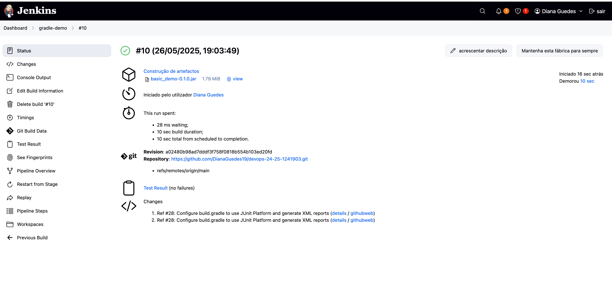
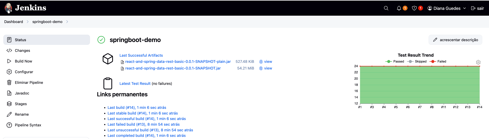
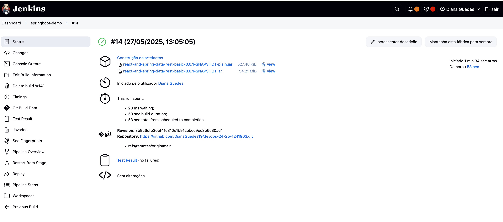

# CA3: CI/CD Pipelines with Jenkins

**Author:** Diana Guedes  
**Date:** 24/02/2025  
**Discipline:** DevOps  
**Program:** SWitCH DEV  
**Institution:** Instituto Superior de Engenharia/ Instituto Politécnico do Porto

## Table of Contents

1. [Introduction](#introduction)
2. [Setup & Prerequisites](#setup--prerequisites)
3. [Part 1: CI/CD Pipeline for the Gradle Basic Demo](#part-1-cicd-pipeline-for-the-gradle-basic-demo)
    1. [Jenkinsfile (excerpt)](#jenkinsfile-excerpt)
    2. [What I Achieved](#what-i-achieved)
    3. [How to Run It](#how-to-run-it)
4. [Part 2: CI/CD Pipeline for React & Spring Data REST](#part-2-cicd-pipeline-for-react--spring-data-rest)
    1. [Jenkinsfile](#jenkinsfile)
    2. [Pipeline Stages](#pipeline-stages)
    3. [Custom Jenkins Master Image](#custom-jenkins-master-image)
    4. [Usage](#usage)
5. [Conclusion](#conclusion)


# Introduction

In this practical exercise, we built two complete CI/CD pipelines in Jenkins, automating every phase from code checkout to deployment:

1. **Gradle Basic Demo**  
   A minimal Java application using Gradle. We automated:
    - **Source Checkout** from GitHub
    - **Build & Assemble** via `./gradlew clean assemble`
    - **Unit Testing** with JUnit 5 (publishing XML results for Jenkins)
    - **Artifact Archiving** of the generated JAR

2. **React + Spring Data REST**  
   A full-stack project combining a React frontend and Spring Boot backend. Our pipeline covered:
    - **Source Checkout** from GitHub
    - **Dockerfile Generation** for the Spring Boot service
    - **Build & Assemble**:
        - Frontend bundling (Webpack)
        - Backend `bootJar` via Gradle
    - **Unit Testing** (JUnit 5)
    - **Javadoc Generation** (HTML reports published in Jenkins)
    - **Artifact Archiving** of the JAR
    - **Docker Image Build & Push** to Docker Hub

To enable Docker operations inside Jenkins, we ran Jenkins in a custom Docker image pre-installed with the Docker CLI, and configured secure Docker Hub credentials. This README details each pipeline stage and the configuration steps required for a fully automated build-test-deploy workflow.  


## Setup & Prerequisites

Before diving into the pipeline configuration, make sure you have the following components in place:

- **Git**
    - Required for cloning your repositories.
    - Verify with:
      ```bash
      git --version
      ```

- **Docker**
    - Needed to build and run container images (including our Jenkins server).
    - Verify with:
      ```bash
      docker --version
      ```

- **Jenkins**
    - We ran Jenkins inside a Docker container (based on `jenkins/jenkins:lts`) with the Docker CLI pre-installed.
    - After starting Jenkins on `http://localhost:8080`, complete the initial setup (unlock, install suggested plugins).

- **JDK 17 & Gradle Wrapper**
    - JDK 17 is required by both the Gradle demo and the Spring Boot project.
    - Each repo includes a Gradle wrapper, so no system-wide Gradle install is needed.
    - You can verify locally with:
      ```bash
      ./gradlew --version
      ```

- **Jenkins Plugins**
    - **Pipeline: Declarative** — for Jenkinsfile support
    - **Git** — to checkout code
    - **HTML Publisher** — to publish Javadoc reports
    - **JUnit** — to display test results
    - **Docker Pipeline** — to run `docker.build()` and `docker.withRegistry()` inside your pipeline

- **Docker Hub Credentials**
    - Create a “Username with password” credential in Jenkins (ID: `dockerhub-creds-id`).
    - Used by the pipeline to push your Spring Boot Docker image.

Once these prerequisites are met, you’re ready to clone the repo and run the Jenkins pipelines that handle checkout, build, test, documentation, artifact archival, and Docker image publishing—completely automated.  


## Part 1: CI/CD Pipeline for the Gradle Basic Demo

In the first exercise, we created a Declarative Pipeline in Jenkins to build, test and archive the **Gradle Basic Demo** (located under `CA1/part2/gradle_basic_demo`). All steps are driven by a `Jenkinsfile` checked into the same repo.

### Jenkinsfile (excerpt)

```groovy
pipeline {
    agent any
    stages {
        stage('Checkout') {
            steps {
                echo 'Checking out from repository'
                git url: 'https://github.com/DianaGuedes19/devops-24-25-1241903.git', branch: 'main'
            }
        }
        stage('Assemble') {
            steps {
                dir('CA1/part2/gradle_basic_demo') {
                    echo 'Assembling...'
                    sh 'chmod +x gradlew'
                    sh './gradlew clean assemble'
                }
            }
        }
        stage('Test') {
            steps {
                dir('CA1/part2/gradle_basic_demo') {
                    echo 'Running Tests...'
                    sh './gradlew test'
                    junit '**/build/test-results/**/*.xml'
                }
            }
        }
        stage('Archive') {
            steps {
                dir('CA1/part2/gradle_basic_demo') {
                    echo 'Archiving artifacts...'
                    archiveArtifacts artifacts: 'build/libs/*.jar', fingerprint: true
                }
            }
        }
    }
}
````

### What I Achieved

1. **Checkout**
    * Pulled the `main` branch from GitHub into the Jenkins workspace.

2. **Assemble**
    * Made the Gradle wrapper executable.
    * Ran `./gradlew clean assemble` to compile, process resources, and package the JAR.

3. **Test**
    * Invoked `./gradlew test` to compile and run JUnit tests.
    * Collected XML test reports so Jenkins can mark the build as passed/failed and show test details.

4. **Archive**
    * Stored the generated `*.jar` under **“Build Artifacts”** in Jenkins.
    * Enabled fingerprinting to track where this artifact is used later.

### How to Run It

1. **Create a Pipeline Job**
    * In Jenkins: **New Item → Pipeline**
    * Under **Pipeline → Definition**, select **Pipeline script from SCM**.
    * Choose **Git**, branch `main`.
    * Set **Script Path** to `CA1/part2/gradle_basic_demo/Jenkinsfile`.

2. **Build**
    * Click **Build Now** and watch the console log for each stage.
    * Upon success, i saw the test results in the **Tests** tab and the JAR under **Last Successful Artifacts**.




This automated pipeline guarantees that every commit to `main` is immediately validated, tested, and packaged—providing fast feedback and reliable artifacts.


## Part 2: CI/CD Pipeline for React & Spring Data REST

In this second exercise, i extended our CI/CD setup to the **React and Spring Data REST** application (located under `CA1/part3/react-and-spring-data-rest-basic`). 
I also created a custom Jenkins image with Docker support so that my pipeline can build and push Docker images.

### Jenkinsfile

```groovy
pipeline {
    agent any

    environment {
        DOCKER_CREDENTIALS_ID = 'dockerhub-creds-id'
        DOCKER_IMAGE          = 'dianaguedes/springboot-app'
        DOCKER_REGISTRY       = 'https://index.docker.io/v1/'
        REPO_URL              = 'https://github.com/DianaGuedes19/devops-24-25-1241903.git'
    }

    stages {
        stage('Checkout') {
            steps {
                echo 'Checking out...'
                git branch: 'main', url: env.REPO_URL
            }
        }

        stage('Create Dockerfile') {
            steps {
                dir('CA1/part3/react-and-spring-data-rest-basic') {
                    echo 'Writing Dockerfile...'
                    script {
                        writeFile file: 'Dockerfile', text: '''
   FROM eclipse-temurin:17-jdk
   WORKDIR /app
   COPY build/libs/*.jar app.jar
   EXPOSE 8080
   ENTRYPOINT ["java","-jar","app.jar"]
   '''

                    }
                }
            }
        }

        stage('Assemble') {
            steps {
                dir('CA1/part3/react-and-spring-data-rest-basic') {
                    echo 'Assembling...'
                    sh 'chmod +x gradlew'
                    sh './gradlew clean assemble'
                }
            }
        }

        stage('Test') {
            steps {
                dir('CA1/part3/react-and-spring-data-rest-basic') {
                    echo 'Testing...'
                    sh './gradlew test'
                    junit '**/build/test-results/**/*.xml'
                }
            }
        }

        stage('Javadoc') {
            steps {
                dir('CA1/part3/react-and-spring-data-rest-basic') {
                    echo 'Generating Javadoc…'
                    sh './gradlew javadoc'
                    publishHTML(target: [
                            allowMissing: false,
                            alwaysLinkToLastBuild: true,
                            keepAll: true,
                            reportDir:   'build/docs/javadoc',
                            reportFiles: 'index.html',
                            reportName:  'Javadoc'
                    ])
                }
            }
        }

        stage('Archive') {
            steps {
                dir('CA1/part3/react-and-spring-data-rest-basic') {
                    echo 'Archiving...'
                    archiveArtifacts artifacts: 'build/libs/*.jar', fingerprint: true
                }
            }
        }

        stage('Build Docker Image') {
            steps {
                dir('CA1/part3/react-and-spring-data-rest-basic') {
                    echo 'Building & Pushing Docker image...'
                    script {
                        def app = docker.build("${env.DOCKER_IMAGE}:${env.BUILD_NUMBER}", '.')
                        docker.withRegistry(env.DOCKER_REGISTRY, env.DOCKER_CREDENTIALS_ID) {
                            app.push()
                        }
                    }
                }
            }
        }
    }

    post {
        always {
            cleanWs()
        }
    }
}
````

### Pipeline Stages

1. **Checkout**
   Pull the `main` branch from GitHub into the Jenkins workspace.
2. **Create Dockerfile**
   Dynamically generate a Dockerfile that packages the Spring Boot JAR into a container.
3. **Assemble**
   Build both the React frontend and Spring backend with `./gradlew clean assemble`.
4. **Test**
   Execute unit tests and publish the JUnit XML results in Jenkins.
5. **Javadoc**
   Generate HTML documentation and archive it via the HTML Publisher.
6. **Archive**
   Store the built JAR as a fingerprinted artifact.
7. **Build Docker Image**
    * Build the Docker image using the generated Dockerfile.
    * Push it to Docker Hub using the stored credentials.

### Custom Jenkins Master Image

To allow Jenkins to run Docker commands inside the pipeline, we built a custom Jenkins container:

```dockerfile
FROM jenkins/jenkins:lts

USER root
RUN apt-get update \
 && apt-get install -y docker.io \
 && rm -rf /var/lib/apt/lists/*

USER jenkins
```

Mounting the host’s Docker socket into this container (`-v /var/run/docker.sock:/var/run/docker.sock`) enables the pipeline to build and push images directly.

### Usage

1. **Build & Run Jenkins**

   ```bash
   docker build -t my-jenkins-with-docker .
   docker run -d --name jenkins \
     -p 8080:8080 -p 50000:50000 \
     -v jenkins_home:/var/jenkins_home \
     -v /var/run/docker.sock:/var/run/docker.sock \
     my-jenkins-with-docker
   ```
2. **Add Docker Hub Credentials**
    * Jenkins → Manage Jenkins → Manage Credentials → Global → Add → Username with password
    * ID: `dockerhub-creds-id`
    * 
3. **Create Pipeline Job**
    * New Item → Pipeline
    * Definition: Pipeline script from SCM → Git → URL + branch `main`
    * Script Path: `CA1/part3/react-and-spring-data-rest-basic/Jenkinsfile`
   
4. **Run & Verify**
    * Click **Build Now**, watch each stage in the console.
    * Confirm the Docker image appears in your Docker Hub repository.





This setup fully automates build, test, documentation, and containerization for our React + Spring application.


## Conclusion

This project reinforced the end-to-end CI/CD workflow by implementing two Jenkins pipelines—from a simple Gradle build to a full React + Spring Data REST service with containerization. Key takeaways include:

- **Pipeline as code**  
  Defining each stage (checkout, build, test, docs, archive, Docker image) in a `Jenkinsfile` ensures every change follows the same automated path.

- **Automated quality gates**  
  Running unit tests and publishing JUnit results catches regressions early. Publishing Javadoc keeps documentation up to date.

- **Artifact management**  
  Archiving JARs with fingerprints provides traceability, and dynamically generating Dockerfiles guarantees consistent container images.

- **Docker integration**  
  Building a custom Jenkins master with Docker support let us build and push images directly from the pipeline, streamlining deployment.

By codifying these steps, we eliminated manual interventions, reduced human error, and accelerated our delivery cycle. This hands-on experience deepened my mastery of Jenkins declarative pipelines and Docker workflows—laying the foundation for more advanced deployments in cloud or Kubernetes environments.


